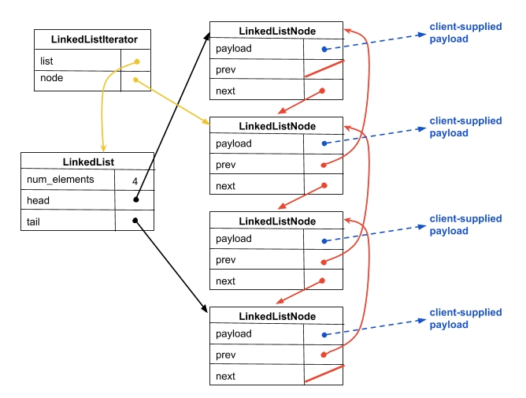
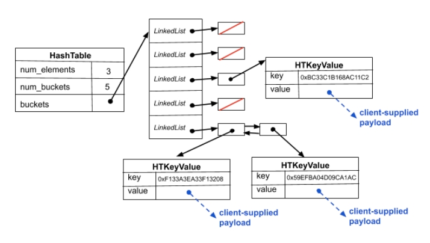

## Goals
For Homework #1, you will finish our implementation of two C data structures: a `doubly-linked list` (Part A) and a `chained hash table` (Part B). You will gain experience and proficiency with C programming, particularly `memory management`, `pointers`, and `linked data structures`.

## Part A: Doubly-Linked List

Each node in a doubly-linked list has three fields: `a payload`,` a pointer to the previous element in the list` (or NULL if there is no previous element), and `a pointer to the next element in the list`.  If the list is empty, there are no nodes. If the list has a single element, both of its next and previous pointers are NULL.


这意味着list节点中的payload元素需要是list实现的客户提供的指针  
鉴于指针可能指向客户malloc'ed的内容，这意味着我们可能需要在列表被销毁时帮助客户释放负载  
C不是垃圾收集语言：您自己负责管理内存分配和释放。

### LinkedList
包含链接列表元数据的结构，例如头指针和尾指针。当我们的客户要求我们分配一个新的空链表时，我们malloc并初始化这个结构的一个实例，然后将指向这个malloc'ed结构的指针返回给客户。

### LinkedListNode
此结构表示双链接列表中的节点。它包含一个用于隐藏（指向）客户提供的有效负载的字段，以及指向列表中上一个和下一个LinkedListNode的字段。当客户请求我们向链表中添加元素时，我们将malloc一个新的LinkedListNode以存储指向该元素的指针，执行将LinkedListNode拼接到数据结构中的操作，并更新LinkedList的元数据。
### LLIterator
有时客户希望浏览链接列表；为了帮助他们做到这一点，我们为他们提供了一个迭代器。LLIterator包含与迭代器关联的簿记。特别是，它跟踪与迭代器关联的列表以及迭代器当前指向的列表中的节点。请注意，这里存在一致性问题：如果客户通过删除节点来更新链接列表，则某些现有迭代器可能由于引用了已删除的节点而变得不一致。所以，我们让我们的客户承诺，他们将释放任何活迭代器之前，变异的链表。（因为我们很慷慨，所以我们允许客户保留一个迭代器，如果使用该迭代器进行了变异。）当客户请求一个新的迭代器时，我们malloc一个实例并将指向它的指针返回给客户。
### Instructions
1. 确保您熟悉C指针、结构、malloc和free
2. 获取hw1的源文件。$ git pull
3. Look inside the hw1 directory.  
- Makefile: 在CSE-Linux机器上，可以使用Linux命令make编译赋值的Makefile。
- LinkedList.h: 定义和记录链接列表API的头文件。链接列表的客户包括此头文件并使用中定义的函数。请仔细阅读此头文件以了解链接列表的预期行为。
- LinkedList_priv.h: LinkedList.c包含的私有头文件；它定义了我们上面绘制的结构。通过将这个头的内容直接放在LinkedList.c中，这些实现细节通常会从客户机中保留下来；但是，我们选择将它们放在“private.h”中，这样我们的单元测试代码就可以验证链表内部的正确性。
- LinkedList.c: 包含部分完成的双链接列表的实现。您的任务将是完成实施。找到标有“步骤X：”的标签——这些标签标识您将要完成的实现的缺失部分。
- example_program_ll.c: 这是一个客户如何使用链表的简单示例；在其中，您可以看到客户如何分配链表、向链表中添加元素、创建迭代器、使用迭代器进行一点导航，然后进行清理。
- test_linkedlist.cc: 此文件包含我们编写的单元测试，以验证链表实现是否正常工作。单元测试是使用Google测试单元测试框架编写的，它与Java的JUnit测试框架有相似之处。此外，此测试驱动程序将帮助课程工作人员对作业进行评分。当您将更多的部分添加到实现中时，测试驱动程序将进一步完成单元测试，并将打印出一个累积分数。您不需要了解此任务的测试驱动程序中有什么内容，但是如果您查看一下其中的内容，您可能会得到关于您应该在实现中执行哪些操作的提示！
- solution_binaries: 在这个目录中，您将找到一些Linux可执行文件。这些二进制文件是用完整的工作版本LinkedList.c编译的；您可以运行它们来探索当您的作业工作时应该显示什么！
4. Run `make` on a CSE Linux machine。
5. Try `./test_suite` and `./example_program_ll`
6. 完成LinkedList.c的实现。浏览LinkedList.c，找到每个写有“步骤X”的注释，并将工作代码放在那里. `自上而下通读代码` 和 `经常重新编译` 会有帮助
### STEP 1: LinkedList_Allocate
```c
LinkedList* LinkedList_Allocate(void) {
  // Allocate the linked list record.
  LinkedList *ll = (LinkedList *) malloc(sizeof(LinkedList));
  Verify333(ll != NULL);

  // STEP 1: initialize the newly allocated record structure.
  ll->num_elements = 0;
  ll->head = NULL;
  ll->tail = NULL;
  // Return our newly minted linked list.
  return ll;
}
  ```
### 函数指针
return_type (*pointer_name)(parameter_list);
```c
//(1) 定义一个普通函数
#include <stdio.h>

int add(int a, int b) {
    return a + b;
}
//(2) 声明和初始化函数指针
int (*func_ptr)(int, int);  // 声明一个函数指针
func_ptr = &add;            // 将函数地址赋值给指针

//(3) 使用函数指针调用函数
int result = func_ptr(3, 4);  // 调用函数
printf("Result: %d\n", result);  // 输出结果：7

```
```c
//(1) 定义一个普通函数
void ExamplePayload_Free(LLPayload_t payload) {
  Verify333(payload != NULL);
  free(payload);
}
//(2) 定义类型是函数指针
typedef void(*LLPayloadFreeFnPtr)(LLPayload_t payload); //定义类型是函数指针

void LinkedList_Free(LinkedList *list,
                     LLPayloadFreeFnPtr payload_free_function);

//(3) 使用函数指针调用函数
//&ExamplePayload_Free 将函数地址赋值给指针
LinkedList_Free(list, &ExamplePayload_Free);
```
### 结构

### STEP 2: LinkedList_Free

```c
void LinkedList_Free(LinkedList *list,
                     LLPayloadFreeFnPtr payload_free_function) {
  Verify333(list != NULL);
  Verify333(payload_free_function != NULL);

  // STEP 2: sweep through the list and free all of the nodes' payloads
  // (using the payload_free_function supplied as an argument) and
  // the nodes themselves.
  while(list->head != NULL){
    //using function pointer free the head's payload:
    //function is ExamplePayload_Free(LLPayload_t payload) 
    //can be found in example_problem_ll.c
    payload_free_function(list->head->payload);
    //save current node pointer to temp
    LinkedListNode* temp = list->head;
    //move head pointer to next
    list->head = list->head->next;
    //free the temp pointer
    free(temp);
  }  
  // free the LinkedList
  free(list);
}

```
### STEP 3: LinkedList_Push

```C
void LinkedList_Push(LinkedList *list, LLPayload_t payload) {
  Verify333(list != NULL);

  // Allocate space for the new node.
  LinkedListNode *ln = (LinkedListNode *) malloc(sizeof(LinkedListNode));
  Verify333(ln != NULL);

  // Set the payload
  ln->payload = payload;

  if (list->num_elements == 0) {
    // Degenerate case; list is currently empty
    Verify333(list->head == NULL);  //if not NULL can continue
    Verify333(list->tail == NULL);
    ln->next = ln->prev = NULL;
    list->head = list->tail = ln;
    list->num_elements = 1;
  } else {
    // STEP 3: typical case; list has >=1 elements
    //make sure head and tail not empty
    Verify333(list->head != NULL);
    Verify333(list->tail != NULL);
    // let ln become head
    ln->next = list->head;
    ln->prev = NULL;
    list->head->prev = ln;
    list->head = ln;
    list->num_elements +=1;
  }
}
```
### STEP 4: LinkedList_Pop
```c
//payload_ptr不是链表操作的正式输入数据，而是用于将弹出的节点负载（payload）保存到变量中，以便进行后续验证和处理。
bool LinkedList_Pop(LinkedList *list, LLPayload_t *payload_ptr) {
  Verify333(payload_ptr != NULL);
  Verify333(list != NULL);

  // STEP 4: implement LinkedList_Pop.  
  // pop false for empty list
  if (list->num_elements == 0){
    return false;
  }
  
  // save payload to payload_ptr
  *payload_ptr = list->head->payload;
  // save the head pointer to temp
  LinkedListNode* temp = list->head;
  
  if (list->num_elements == 1) {
    // a list with a single element in it
    list->head = NULL;
    list->tail = NULL;
  } else {
    // a list with >=2 elements in it
    list->head = list->head->next;
    list->head->prev = NULL;
  }

  list->num_elements -= 1;
  // free the previous head
  free(temp);
  //pop succeeded
  return true;
}
```
### STEP 5: LinkedList_Append
```c
void LinkedList_Append(LinkedList *list, LLPayload_t payload) {
  Verify333(list != NULL);

  // STEP 5: implement LinkedList_Append.  It's kind of like
  // LinkedList_Push, but obviously you need to add to the end
  // instead of the beginning.

  // Allocate space for the new node.
  LinkedListNode *ln = (LinkedListNode *) malloc(sizeof(LinkedListNode));
  Verify333(ln != NULL);

  // set the payload
  ln->payload = payload;

  // the case that list is empty
  if (list->num_elements == 0) {
    // degenerate case; list is currently empty
    Verify333(list->head == NULL);
    Verify333(list->tail == NULL);

    ln->next = ln->prev = NULL;
    list->head = list->tail = ln;
    list->num_elements = 1U;
  } else{

  // the case that list is not empty
  //make sure head and tail not empty
  Verify333(list->head != NULL);
  Verify333(list->tail != NULL);

  //let ln become tail
  ln->next = NULL;
  ln->prev = list->tail;
  list->tail->next = ln;
  list->tail = ln;
  list->num_elements += 1;
  } 
}
```
### 迭代器（Iterator）
迭代器的作用
1. 逐个访问容器的元素  
迭代器提供了一种统一的方式来遍历容器，而不需要关心容器的内部结构。

2. 支持不同类型的容器  
无论是数组、链表、哈希表还是树，只要容器支持迭代器，用户就可以通过相同的方式访问其元素。

3. 提高代码的可读性和可维护性  
使用迭代器可以避免繁琐的索引操作或遍历逻辑，使代码更加直观和易懂。

迭代器的工作原理  
迭代器通常是一个对象，它包含了以下三个主要操作：

- 初始化：指向集合的第一个元素。
- 移动：跳转到集合中的下一个元素。
- 访问：获取迭代器当前指向的元素值。

```c
typedef struct ll_iter {
  LinkedList       *list;  // the list we're for
  LinkedListNode   *node;  // the node we are at, or NULL if broken
} LLIterator;
```
### STEP 6: LLIterator_Next
```c
bool LLIterator_Next(LLIterator *iter) {
  Verify333(iter != NULL);
  Verify333(iter->list != NULL);
  Verify333(iter->node != NULL);

  // STEP 6: try to advance iterator to the next node and return true if
  // you succeed, false otherwise
  // Note that if the iterator is already at the last node,
  // you should move the iterator past the end of the list

  // advance iterator if there is a node after it
  if (iter->node->next != NULL) {
    // if there is a node after iterator, move to next and return true
    iter->node = iter->node->next;
    return true;
  } else {
    // if there is no node after iterator, set NULL and return false
    iter->node = NULL;
    return false;
  }
}
```
### STEP 7: LLIterator_Remove
```c
bool LLIterator_Remove(LLIterator *iter,
                       LLPayloadFreeFnPtr payload_free_function) {
  Verify333(iter != NULL);
  Verify333(iter->list != NULL);
  Verify333(iter->node != NULL);

  // STEP 7: implement LLIterator_Remove.  This is the most
  // complex function you'll build.  There are several cases
  // to consider:
  // - degenerate case: the list becomes empty after deleting.
  // - degenerate case: iter points at head
  // - degenerate case: iter points at tail
  // - fully general case: iter points in the middle of a list,
  //                       and you have to "splice".
  //
  // Be sure to call the payload_free_function to free the payload
  // the iterator is pointing to, and also free any LinkedList
  // data structure element as appropriate.


  // free the current node's payload
  payload_free_function(iter->node->payload);
  // pointer to the current node
  LinkedListNode* temp = iter->node;

  // the list becomes empty after deleting.
  if(iter->list->num_elements == 1){
    iter->node = NULL;
    iter->list->num_elements = 0;
    iter->list->head = NULL;
    iter->list->tail = NULL;

    // free the iter node
    free(temp);
    // return false since the list is empty now
    return false;
  }
  iter->list->num_elements -= 1;
  
  if(iter->node->prev == NULL){
    //iter points at head    iter->node == iter->list->head
    iter->node = iter->node->next;
    iter->node->prev = NULL;
    iter->list->head = iter->node;
  } else if(iter->node->next == NULL){
    //iter points at tail
    iter->node = iter->node->prev;
    iter->node->next = NULL;
    iter->list->tail = iter->node;
  } else {
    //normal case
    iter->node->prev->next = iter->node->next;
    iter->node->next->prev = iter->node->prev;
    iter->node = iter->node->next;
  }

  free(temp);

  return true;  // you may need to change this return value
}
```
### STEP 8: implement LLSlice
```c
bool LLSlice(LinkedList *list, LLPayload_t *payload_ptr) {
  Verify333(payload_ptr != NULL);
  Verify333(list != NULL);

  // STEP 8: implement LLSlice.
  // return false since nothing can be sliced from the empty list
  if (list->num_elements == 0) {
    return false;
  }
  // store the payload of tail 
  *payload_ptr = list->tail->payload;
  // old tails pointer, save to temp and going to free later
  LinkedListNode* temp =list-> tail;

  if (list->num_elements == 1) {
    //only have one node
    list->head = NULL;
    list->tail = NULL;
  } else {
    //normal case
    list->tail = list->tail->prev;
    list->tail->next = NULL;
  }

  list->num_elements -= 1;
  //free the old tail
  free(temp);
  // return true since slice succeed
  return true;
}
```
### TEST and GIT
```
$ ./test_suite --gtest_filter=Test_LinkedList.*

$ valgrind --leak-check=full ./solution_binaries/example_program_ll

$ valgrind --leak-check=full ./solution_binaries/test_suite

$ ../cpplint.py --clint  LinkedList.c

$ git status

$ git add .

$ git commit -m "LinkedList.c part finish, pass all test_suite, Valgrind, and cpplint"

$ git push
```
## Part B: Chained Hash Table
链式哈希表是一种数据结构，它由一组bucket组成，每个bucket包含一个元素的链表。当用户将密钥/值对插入哈希表时，哈希表使用哈希函数将密钥映射到其中一个bucket中，然后将密钥/值对添加到链接列表中。

有一个重要的角点情况：如果插入的键/值对的键已经存在于哈希表中；我们的哈希表实现将现有的键/值对替换为新的键/值对，并将旧的键/值对返回给客户。

随着时间的推移，随着越来越多的元素被添加到哈希表中，挂在每个bucket上的链接列表将开始增长。只要哈希表中的元素数是bucket数的一个小倍数，查找时间就很快：对键进行哈希以找到bucket，然后遍历挂起bucket的（短）链（链表），直到找到键。随着元素的数量越来越大，查找的效率越来越低，因此我们的哈希表包含通过增加bucket的数量来调整自身大小的逻辑，以保持短链。

### HashTable
包含哈希表元数据的结构，例如元素数和bucket数组。当客户要求我们分配一个新的空哈希表时，我们malloc并初始化该表的一个实例（包括为它使用的bucket数组分配malloc'ing空间和为每个bucket分配linkedList），并将指向该malloc'ed结构的指针返回给客户。

### HTIterator 
有时客户希望遍历哈希表中的所有元素；为了帮助他们做到这一点，我们为他们提供了一个迭代器。HTIterator指向包含与迭代器关联的簿记的结构。与链表迭代器类似，哈希表迭代器跟踪与该迭代器相关联的哈希表，此外，还具有用于在bucket链表中进行迭代的链表迭代器。当客户要求一个新的迭代器时，我们malloc一个HTIterator并返回一个指向它的指针。

### Instructions
1. 在A部分中获取的代码还包含完成哈希表实现并对其进行测试所需的文件。与链表类似，哈希表实现被拆分为几个文件：`HashTable.c`包含需要完成的实现；`HashTable.h`包含哈希表的公共接口，并记录客户看到的所有函数和结构；`HashTable_priv.h`包含HashTable.c使用的一些私有内部结构。

2. 阅读`HashTable.h`，首先了解HashTable接口语义是什么。然后，看一下`example_program_ht.c`；这是一个程序，它使用哈希表接口插入/查找/删除哈希表中的元素，并使用迭代器接口遍历哈希表中的元素。

3. 和前面一样，`test_hashtable.cc`包含我们针对哈希表的Google测试单元测试。单独运行它，并使用valgrind来查看您离完成哈希表实现有多近。

4. 查看`HashTable.c`，找到所有缺失的部分（如前所述，由步骤X注释标识），并实现它们。

5. 和以前一样，在`solution_binaries`文件中，我们提供了linux可执行文件，这些文件是用我们完整的工作版本的HashTable编译的。c您可以运行它们来探索当part B实现工作时应该显示什么，并查看源代码中有关如何使用数据结构的示例。
### HashKeyToBucketNum
```c
int HashKeyToBucketNum(HashTable *ht, HTKey_t key) {
  return key % ht->num_buckets;
}
```
### HashTable_Allocate
```c
HashTable* HashTable_Allocate(int num_buckets) {
  HashTable *ht;
  int i;

  Verify333(num_buckets > 0);

  // Allocate the hash table record.
  ht = (HashTable *) malloc(sizeof(HashTable));
  Verify333(ht != NULL);

  // Initialize the record.
  ht->num_buckets = num_buckets;
  ht->num_elements = 0;
  ht->buckets = (LinkedList **) malloc(num_buckets * sizeof(LinkedList *));
  Verify333(ht->buckets != NULL);
  for (i = 0; i < num_buckets; i++) {
    ht->buckets[i] = LinkedList_Allocate();
  }

  return ht;
}
```
制作一个buckets的array，然后每一个bucket是一个linkedlist


### Step1: HashTable_Insert
```c
bool HashTable_Insert(HashTable *table,
                      HTKeyValue_t newkeyvalue,
                      HTKeyValue_t *oldkeyvalue) {
  int bucket;
  LinkedList *chain;

  Verify333(table != NULL);
  MaybeResize(table);

  // Calculate which bucket and chain we're inserting into.
  bucket = HashKeyToBucketNum(table, newkeyvalue.key);
  chain = table->buckets[bucket];

  // STEP 1: finish the implementation of InsertHashTable.
  // This is a fairly complex task, so you might decide you want
  // to define/implement a helper function that helps you find
  // and optionally remove a key within a chain, rather than putting
  // all that logic inside here.  You might also find that your helper
  // can be reused in steps 2 and 3.

  // allocate space for HTKeyValue_t
  HTKeyValue_t* newpair = (HTKeyValue_t*) malloc(sizeof(HTKeyValue_t));
  if (newpair == NULL) {
    return false;  // // 没有分配内存成功，不需要 free
  }
  // make a copy of new key/value passed in
  // newpair is pointer, use `->`; newkeyvaluse is a struct, use `.`
  newpair->key = newkeyvalue.key;
  newpair->value = newkeyvalue.value;

  // no need to search if size of the chain is 0
  // directly add to the bucket
  if (LinkedList_NumElements(chain) == 0) {
    LinkedList_Push(chain, (void*) newpair);
    table->num_elements += 1;
    // push succeeded
    return true;
  }

  // ***
  // make an iterator for the bucket
  LLIterator* lliter = LLIterator_Allocate(chain);

  // return false if didn't creat lliter succeed 
  if (lliter == NULL) {
    free(newpair);
    return false;
  }

  HTKeyValue_t* oldpair;

  // check if the bucket contains the new key
  if (HasKey(lliter, newkeyvalue.key, &oldpair)) {
    // bucket contains new key
    LinkedList_Append(chain, (void*)newpair);
    // copy the oldpair to the oldkeyvalue
    oldkeyvalue->key = oldpair->key;
    oldkeyvalue->value = oldpair->value;

    // free the oldpair
    free(oldpair);
    // detele oldpair from the bucket
    LLIterator_Remove(lliter, &LLNoOpFree);
    LLIterator_Free(lliter);
    return true;
  }
  // really new key
  LLIterator_Free(lliter);
  LinkedList_Append(chain, (void*)newpair);

  table->num_elements += 1;
  return 1;
}
```

### helper function
```c
// ***
// Helper Function
// check whether there is a key same with new key in the bucket
static bool HasKey (LLIterator* lliter,
                          HTKey_t key,
                          HTKeyValue_t** keyvalue) {
  Verify333(lliter != NULL);
  while (true) {
    // Use: void LLIterator_Get(LLIterator *iter, LLPayload_t *payload);
    LLIterator_Get(lliter, (void**) keyvalue);
    // key is found
    // type of *keyvalue is HTKeyValue_t*
    if ((*keyvalue)->key == key) {
      return true;
    }

    // key is not found in the list
    if (!LLIterator_Next(lliter)) {
      break;
    }
  }
  // no same key
  return false;
}
```
### Step2: HashTable_Find
注意c中function中的pointer parameter不一定是要用到它的值；

甚至它可能都没有值，我们反而需要向其中输入值。
```c
bool HashTable_Find(HashTable *table,
                    HTKey_t key,
                    HTKeyValue_t *keyvalue) {
  Verify333(table != NULL);

  // STEP 2: implement HashTable_Find.

  uint32_t bucketnum;
  LinkedList* chain;

  // calculate bucket we're looking for
  // get its LinkedList chain
  HashKeyToBucketNum(table, key);
  chain = table->buckets[bucketnum];

  // return 0 is no pair in the chain
  if (LinkedList_NumElements(chain) == 0){
    return false;
  }
  // make an iterator for the bucket
  LLIterator* lliter = LLIterator_Allocate(chain);

  // return false if didn't creat lliter succeed 
  if (lliter == NULL) {
    return false;
  }
  HTKeyValue_t *pair;
  if (HasKey(lliter, key, &pair)) {
    keyvalue->key = pair->key;
    keyvalue->value = pair->value;

    LLIterator_Free(lliter);
    // find the key, return true
    return true;
  }

  LLIterator_Free(lliter);
  // didn't find the key, return false
  return false;
}
```
### Step3 HashTable_Remove
```c
bool HashTable_Remove(HashTable *table,
                      HTKey_t key,
                      HTKeyValue_t *keyvalue) {
  Verify333(table != NULL);

  // STEP 3: implement HashTable_Remove.
  int bucketnum;
  LinkedList* chain;

  // calculate the bucket we're looking for
  // get its LinkedList chain
  bucketnum =  HashKeyToBucketNum(table, key);
  chain = table->buckets[bucketnum];

  // return false if no pair in the chain
  if (LinkedList_NumElements(chain) == 0){
    return false;
  }

  // make an iterator for the bucket
  LLIterator* lliter = LLIterator_Allocate(chain);

  // return false if didn't creat lliter succeed 
  if (lliter == NULL) {
    return false;
  }

  HTKeyValue_t *pair;  // variable to store key/value
  if (HasKey(lliter, key, &pair)) {
    // key in the bucket
    // copy the keyvalue to rethrn parameter pair
    keyvalue->key = pair->key;
    keyvalue->value = pair->value;
    free (pair);

    //remove the pair from the bucket
    LLIterator_Remove(lliter, &LLNoOpFree);
    LLIterator_Free(lliter);
    table->num_elements -= 1;
    // remove succeed
    return true;
  }
  // didn't find the key
  LLIterator_Free(lliter);
  return false;
}
```
### Step4 HTIterator_IsValid
```c
bool HTIterator_IsValid(HTIterator *iter) {
  Verify333(iter != NULL);
  Verify333(iter->ht != NULL);

  // STEP 4: implement HTIterator_IsValid.
  // Check if the iterator's bucket index is valid
  // bucket_idx starts with 0 and num_buckets starts with 1 so `>=`
  if (iter->bucket_idx < 0 || iter->bucket_idx >= iter->ht->num_buckets) {
    return false;
  }
  // Check if the bucket iterator is valid
  if (iter->bucket_it == NULL) {
    return false;
  }
  return LLIterator_IsValid(iter->bucket_it);
}
```
### Step5 HTIterator_Next
```c
bool HTIterator_Next(HTIterator *iter) {
  Verify333(iter != NULL);

  // STEP 5: implement HTIterator_Next.
  // if htiter is invalid return false
  if (!HTIterator_IsValid(iter)) {
    return false;
  }

  // if the current bucket has next element,
  if (LLIterator_Next(iter->bucket_it)) {
    return true;
  }

  // if cureent bucket didn't have
  // if theis is the last bucket
  if (iter->bucket_idx == iter->ht->num_buckets - 1) {
    return false;
  }

  int i;  // buketnum
  // find the next non-empty bucket
  for (i = iter->bucket_idx + 1; i < iter->ht->num_buckets; i++) {
    if (LinkedList_NumElements(iter->ht->buckets[i]) > 0) {
      iter->bucket_idx = i;
      break;
    }
  }

  // if there is no non-empty bucket
  if (i == iter->ht->num_buckets) {
    return false;
  }
  // if there is a non-empty bucket
  LLIterator_Free(iter->bucket_it);
  iter->bucket_it = LLIterator_Allocate(iter->ht->buckets[iter->bucket_idx]);

  // didn't attlcate well
  if (iter->bucket_it == NULL) {
    false;
  }
  // succeed move to next non-empty buket
  return true;
}
```
### Step6 HTIterator_Get
```c
bool HTIterator_Get(HTIterator *iter, HTKeyValue_t *keyvalue) {
  Verify333(iter != NULL);

  // STEP 6: implement HTIterator_Get.

  HTKeyValue_t *pair;  //// variable to store key/value

  if (HTIterator_IsValid(iter)) {
    LLIterator_Get(iter->bucket_it, (LLPayload_t) &pair);

    // copy the key/value store in payload to return parameter keyvalue
    keyvalue->key = pair->key;
    keyvalue->value = pair->value;

    // get succeed
    return true;
  }

  // get failed
  return false;  // you may need to change this return value
}
```
### make error HasKey
```c
// ***
// Helper Function
// check whether there is a key same with new key in the bucket
static bool HasKey (LLIterator* lliter,
                          HTKey_t key,
                          HTKeyValue_t** keyvalue);
```
forgot // Function Declaration at the begining of the file
### Linux Vim
1. 基本移动命令
- `h`: 左移一个字符
- `l`: 右移一个字符
- `j`: 下移一行
- `k`: 上移一行
- `0`: 跳转到行首
- `^`: 跳转到本行第一个非空白字符
- `$`: 跳转到行尾
- `gg`: 跳转到文件开头
- `G`: 跳转到文件末尾
- `Ngg` 或 `NG`: 跳转到第 N 行，例如 10G 跳到第 10 行
- `%`: 跳转到匹配的括号、花括号或中括号

2. 删除命令
- `x`: 删除光标所在的字符(光标之后的字母)
- `dd`: 删除光标所在的整行
- `d10d`: 删除当前行及其下方 10 行
- `D`: 删除光标到行尾的内容
- `d0`: 删除光标到行首的内容
- `d^`: 删除光标到本行第一个非空白字符
- `:1,10d`: 删除第 1 到第 10 行

3. 复制/粘贴命令
- `yy`: 复制当前行(yank)
- `y10y` 或 `10yy`: 复制当前行及其下方 10 行
- `yw`: 复制一个单词
- `y$`: 复制光标到行尾的内容
- `p`: 在光标后粘贴内容
- `P`: 在光标前粘贴内容

4. 撤销/重做
- `u`: 撤销上一个操作
- `U`: 撤销当前行的所有修改
- `Ctrl + r`: 重做撤销的操作

5. 搜索与替换
`/keyword`: 搜索 keyword，按 n 查找下一个，N 查找上一个
`?keyword`: 向上搜索 keyword
`:%s/old/new/g`: 全局替换 old 为 new
`:1,10s/old/new/g`: 替换第 1 到第 10 行的 old 为 new
`:%s/old/new/gc`: 替换时逐个确认

6. 其他常用命令
- `:`: 进入命令模式
- `:w`: 保存文件
- `:q`: 退出 Vim
- `:wq` 或 `ZZ`: 保存并退出
- `:q!`: 强制退出，不保存
- `:e filename`: 打开新文件
- `:set nu`: 显示行号
- `:set nonu`: 关闭行号

### TEST and GIT
```
$ ./test_suite --gtest_filter=Test_LinkedList.*

$ valgrind --leak-check=full ./solution_binaries/example_program_ht

$ valgrind --leak-check=full ./solution_binaries/test_suite

$ ../cpplint.py --clint  LinkedList.c

$ git status

$ git add .

$ git commit -m "HashTable.c part finish, pass all test_suite, Valgrind, and cpplint"

$ git push

$ git pull
$ make clean
$ git status

$ git rm example_program_ht example_program_ll test_suite

$ git commit -m "remove example_program_ht, example_program_ll, and test_suite"

$ git push

$ git tag hw1-final
$ git push --tags 
```