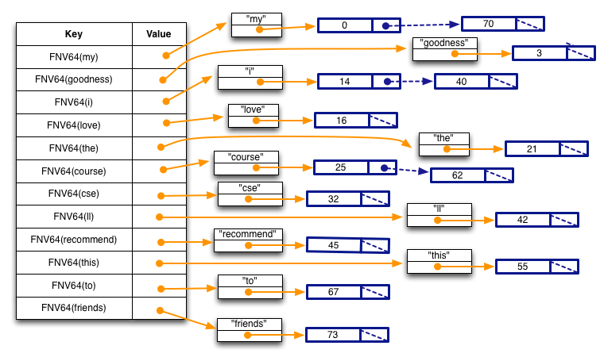

# 📌 Man Page Sections

| Section | Description |
|---------|-------------|
| **1** | **User commands** (executables & shell commands, e.g., `ls`, `cp`, `mv`) |
| **2** | **System calls** (functions provided by the kernel, e.g., `open`, `read`, `write`) |
| **3** | **Library functions** (C standard library, e.g., `printf`, `malloc`) |
| **4** | **Special files** (devices in `/dev`, e.g., `tty`, `null`) |
| **5** | **File formats & config files** (e.g., `/etc/passwd`, `fstab`) |
| **6** | **Games and screensavers** (e.g., `fortune`, `bs`) |
| **7** | **Miscellaneous** (macro packages, conventions, e.g., `man 7 inode`, `man 7 signal`) |
| **8** | **System administration commands** (root-only commands, e.g., `mount`, `iptables`) |
| **9** | **Kernel routines** (internal kernel functions, mostly for developers) |
# emojis
😀 Happy & Excited Faces
😃😁😆😄😅😂🤣😊😇🙂🙃😺😸😹🤗🥳🥰😻💖

😎 Cool & Confident Faces
😎🕶️🤠😏😌🤤😼👑💪🔥🎸🤘😈😇🦸‍♂️🦸‍♀️✨

🤩 Amazed & Star-Struck Faces
🤩😲😯😮😵🤯🤗🤤😍😻💓💞💫💥⚡🎆🎇🌟

🧐 Curious & Playful Faces
🧐🤓🤔🤭🙄😜😝😛🤪😶‍🌫️👀🕵️‍♂️🔎🎭💭💡🔮

🔥 High-Energy & Exciting Emojis  
🚀💥⚡✨🎉🎊💫🌟🚁🚂🏎️💨🔋🚀🚴💨🏃💨🎯🏆🥇🎖️🏅🥳😃😁😆😎🤩

💡 Innovation & Technology Emojis  
🧠💡🔬📡🛰️🤖🔧⚙️💾💻🖥️⌨️🖱️📱📡🎛️🔊📶🔋🔌🔍💿📀🎥🎬📸🎤🎧🎵🎶

📈 Growth & Progress Emojis  
📈📊📉💰💎🔝🔼⬆️🏗️🏢🏛️🏰⛩️🗼🗽🏙️🌆🌇🌄🌅⏫⏭️⏩⏳⌛🕰️⏰🔄

🌍 Space & Futuristic Emojis  
🌍🌎🌏🪐☄️🌠🌌🔭👨‍🚀👩‍🚀🛸👾🦾🦿⚛️☢️☣️🌀♾️🛤️🚦🛰️🛑🚧

🔮 Mystical & Fantasy Emojis  
🧙‍♂️🧙‍♀️🧝‍♂️🧝‍♀️🧛‍♂️🧛‍♀️🧜‍♂️🧜‍♀️🦄🐉🐲🦅🔥🎭🎪💭🤯💥🌀🌈🌊💎🔮

🛠️ Hard Work & Hustle Emojis  
💪🏋️‍♂️🏋️‍♀️⛏️🔨🛠️⚒️🪚🔩🔗🛒🚧🏗️🔎💼📖🗂️📂📝✏️✍️📜📃📄

🔗 Connectivity & Networking Emojis  
📡📡🔗🔄🔀🔁🔂🔃📞📲📶📠📥📤📬📭💬🗨️💭🗣️📢📣💌✉️📧📪📫

🎵 Music & Vibes Emojis  
🎵🎶🎼🎤🎧🎷🎺🎸🥁🎹🎻📻📺🎥📽️🎬🎞️🪄✨🎇🎆🎑🕺💃
# CSE 333 25wi Homework 2 😊🚀
## Goals

In this assignment you will use the LinkedList and HashTable modules that you built in Homework 1 in order to finish our implementation of a `file system crawler`, `indexer`, and `search engine`:

1. In Part A, you will build a module that reads the content of a file into memory, parses it into a series of words, and builds a linked list of (word, list of positions) information. 您将构建一个模块，该模块将文件内容读取到内存中，将其解析为一系列单词，并构建（单词、位置列表）信息的链表。

2. In Part B, you will build modules that convert a series of these linked lists into an in-memory, inverted index. 您将构建模块，将一系列这些链表转换为内存中的倒排索引。

3. In Part C, you will use this in-memory, inverted index to build a query processor that has a console-based interface. 您将使用内存中的倒排索引来构建一个具有基于控制台的接口的查询处理器。

如前所述，请在开始作业前通读整个文档，并请尽早开始！要完成这项任务，你需要做大量的编码，这肯定会暴露出你在C、指针、malloc/free以及LinkedList和HashTable实现的语义等先前材料中存在的任何概念缺陷。

## In-Memory File System Search Engine
### Part A: File Parser
您将编写一个模块，将文本文件的内容读取到内存中，然后解析文本文件以查找其中的单词。当它找到单词时，它将构建一个包含每个单词一条记录的HashTable。每条记录将包含单词的小写副本，以及一个排序的链表。链表的每条记录在单词出现的文件中都包含一个偏移量（文件中的第一个字符偏移量为零）。

我们的单词解析器不会很聪明。它将把任何由非字母字符分隔的非零字母字符序列视为单词。

Specifically, note a few things:

- Each key in the hash table is the result of calling the hashtable module's FNVHash64() function, passing the string as the first argument, and the strlen(string) as the second argument. 哈希表中的每个键都是调用哈希表模块的FNVHash64（）函数的结果，将字符串作为第一个参数传递，将strlen（string）作为第二个参数传递。

- Each element in the hash table is a pointer to a heap-allocated structure that contains two fields; a string and a linked list. Note the string is lower-cased, and that our parser is not very smart: because it treats any sequence of alphabetic characters surrounded by non-alphabetic characters as words, the word I'll will be misparsed as the two words i and ll. 哈希表中的每个元素都是指向包含两个字段的堆分配结构的指针；一个字符串和一个链表。请注意，字符串是小写的，我们的解析器不是很聪明：因为它将任何被非字母字符包围的字母字符序列视为单词，所以单词I将被错误地解析为两个单词I和ll。

- Each element in the linked list is an integer representing the position in the text file at which the word starts; this is both its byte offset and, since we are only handling ASCII files, the number of characters from the start of the file (each ASCII character is exactly 1 byte). So, the word "my" starts at offset 0 in the text file, the word "i" appears twice, once at offset 14 and once at offset 40, and the word "course" appears twice, once at offset 25 and once at offset 62. 链表中的每个元素都是一个整数，表示单词在文本文件中的起始位置；这既是它的字节偏移量，也是因为我们只处理ASCII文件，从文件开头开始的字符数（每个ASCII字符恰好是1个字节）。因此，单词“my”在文本文件中的偏移量0处开始，单词“i”出现两次，一次在偏移量14处，一次是在偏移量40处，单词“course”出现两次于偏移量25处和偏移量62处。

- Each list is sorted in ascending order. 每个列表都按升序排列。

```
// jusut to check what should the correct answer looks like

$ valgrind --leak-check=full ./solution_binaries/test_suite

// ask man for help to check stat
$ man 2 stat

// ask man for help to check inode
$ man 7 inode

// search or find some words in man page or vim page
// / (forward search) or ? (backward search)
//  S_ISREG(m)  is it a regular file?
$ /S_ISREG

// ask man for help to check open
$ man 2 open
```
`FileParser.h`:  

`char* ReadFileToString(const char *file_name, int *size);`
如果文件包含null（即零值），则不提供特殊的转义/处理

Arguments:  
file_name：包含要读取的文件的路径名的字符串  
size：如果成功，则以字节为单位返回大小的输出参数  

Returns:  
NULL: 如果读取失败  
This function will add '\0' to the end of the file; 'size' doesn't include the final '\0'.  

``` c
char* ReadFileToString(const char *file_name, int *size);

typedef struct WordPositions {
  char        *word;        // normalized word.  Owned.
  LinkedList  *positions;   // list of DocPositionOffset_t.  Owned.
} WordPositions;

HashTable* ParseIntoWordPositionsTable(char *file_contents);

void FreeWordPositionsTable(HashTable *table);
///////////////////////////////////////////////////////////////////////////////

#define ASCII_UPPER_BOUND 0x7F

// Since our hash table dynamically grows, we'll start with a small
// number of buckets.
#define HASHTABLE_INITIAL_NUM_BUCKETS 2

// Frees a WordPositions.positions's payload, which is just a
// DocPositionOffset_t.
static void NoOpFree(LLPayload_t payload) { }

// Frees a WordPositions struct.
static void FreeWordPositions(HTValue_t payload) {
  WordPositions *pos = (WordPositions*) payload;
  LinkedList_Free(pos->positions, &NoOpFree);
  free(pos->word);
  free(pos);
}

// Add a normalized word and its byte offset into the WordPositions HashTable.
static void AddWordPosition(HashTable *tab, char *word,
                            DocPositionOffset_t pos);

// Parse the passed-in string into normalized words and insert into a HashTable
// of WordPositions structures.
static void InsertContent(HashTable *tab, char *content);

```

