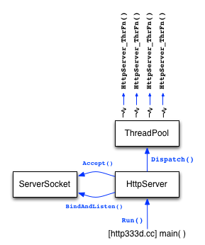
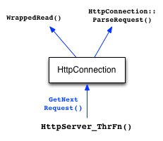
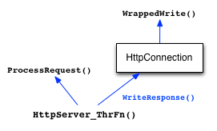

## Goals & Implementation Notes
In this assignment you will build on your HW3 implementation to implement a multithreaded Web server front-end to your query processor. In Part A, you will read through some of our code to learn about the infrastructure we have built for you. In Part B, you will complete some of our classes and routines to finish the implementation of a simple Web server. In Part C, you will fix some security problems in our Web server.在本作业中，您将在HW3实现的基础上构建一个多线程Web服务器前端，以实现查询处理器。在A部分中，您将阅读我们的一些代码，以了解我们为您构建的基础设施。在B部分中，您将完成我们的一些类和例程，以完成简单Web服务器的实现。在C部分中，您将修复Web服务器中的一些安全问题。

As before, please read through this entire document before beginning the assignment, and please start early!如前所述，请在开始作业前通读整个文档，并请尽早开始！

### General Implementation Notes
In HW4, as with HW2 and HW3, you don't need to worry about propagating errors back to callers in all situations. You will use Verify333()'s to spot some kinds of errors and cause your program to crash. However, no matter what a client does, or what input the web server reads, your web server must handle that; only internal issues (such as out of memory) should cause your web server to crash out.在HW4中，与HW2和HW3一样，您不需要担心在所有情况下都会将错误传播回调用者。您将使用Verify333（）来发现某些类型的错误并导致程序崩溃。然而，无论客户端做什么，或者web服务器读取什么输入，您的web服务器都必须处理它；只有内部问题（如内存不足）才会导致您的web服务器崩溃。

As before, you may not modify any of the existing header files or class definitions distributed with the code. If you wish to add extra "helper" functions you can to do that by including additional static functions in the implementation (.cc) files.和以前一样，您不能修改随代码分发的任何现有头文件或类定义。如果你想添加额外的“辅助”函数，你可以通过在实现（.cc）文件中包含额外的静态函数来实现。

You also may not modify the Makefile distributed with the project. In particular, there are reasonable ways to do the necessary string handling without using the Boost Regex library.您也不能修改随项目分发的Makefile。特别是，有一些合理的方法可以在不使用BoostRegex库的情况下进行必要的字符串处理。

### Suggested Work Schedule
To help you schedule your time, here's a suggested order for the parts of this assignment. We're not going to enforce a schedule; it's up to you to manage your time.为了帮助你安排时间，这里有一个建议的任务顺序。我们不会强制执行时间表；时间的安排取决于你。

- Read over the project specifications and understand which code is responsible for what.阅读项目规范，了解哪些代码负责什么。
- Finish `ServerSocket.cc`. Make sure to cover all functionality, not just what is in the unit tests.确保涵盖所有功能，而不仅仅是单元测试中的功能。
- Implement `FileReader.cc`, which should be very easy, and **GetNextRequest()** in `HttpConnection.cc`. 
- Complete **ParseRequest()** in HttpConnection.cc. This can be tricky, as it involves both Boost and string parsing.
- Finish the code for `http333d.cc`.
- Implement **HttpServer_ThrFn()** in HttpServer.cc.
- Complete **ProcessFileRequest()** and **ProcessQueryRequest()** in HttpServer.cc. At this point, you should be able to search the "333gle" site and view the webpages available under /static/, e.g. http://localhost:5555/static/bikeapalooza_2011/index.html.
- Fix the security issues with the website, if you have any.
- Make sure everything works as it is supposed to.

## Part A: Read Through Our Code
Our web server is a fairly straightforward multithreaded application. Every time a client connects to the server, the server dispatches a thread to handle all interactions with that client. Threads do not interact with each other at all, which greatly simplifies the design of the server.我们的web服务器是一个相当简单的多线程应用程序。每次客户端连接到服务器时，服务器都会分派一个线程来处理与该客户端的所有交互。线程根本不相互交互，这大大简化了服务器的设计。



The figure to the right shows the high-level architecture of the server. There is a main class called HttpServer that uses a ServerSocket class to create a listening socket, and then sits in a loop waiting to accept new connections from clients. For each new connection that the HttpServer receives, it dispatches a thread from a ThreadPool class to handle the connection. The dispatched thread springs to life in a function called HttpServer_ThrFn() within the HttpServer.cc file.右侧的图显示了服务器的高级架构。有一个名为HttpServer的主类，它使用ServerSocket类创建一个监听套接字，然后坐在循环中等待接受来自客户端的新连接。对于HttpServer接收到的每个新连接，它都会从ThreadPool类中分派一个线程来处理该连接。被分派的线程在HttpServer.cc文件中名为HttpServer_ThrFn（）的函数中自动启动。

The HttpServer_ThrFn() function handles reading requests from one client. For each request that the client sends, the HttpServer_ThrFn() invokes GetNextRequest() on the HttpConnection object to read in the next request and parse it.HttpServer_ThrFn（）函数处理来自一个客户端的读取请求。对于客户端发送的每个请求，HttpServer_ThrFn（）调用HttpConnection对象上的GetNextRequest（）来读取下一个请求并解析它。

To read a request, the GetNextRequest() method invokes WrappedRead() some number of times until it spots the end of the request. To parse a request, the method invokes the ParseRequest() method (also within HttpConnection). At this point, the HttpServer_ThrFun() has a fully parsed HttpRequest object (defined in HttpRequest.h).要读取请求，GetNextRequest（）方法会多次调用WrappedRead（），直到它发现请求的结束。为了解析请求，该方法调用ParseRequest（）方法（也在HttpConnection中）。此时，HttpServer_ThrFun（）有一个完全解析的HttpRequest对象（在HttpRequest.h中定义）。




The next job of HttpServer_ThrFn() is to process the request. To do this, it invokes the ProcessRequest() function, which looks at the request URI to determine if this is a request for a static file, or if it is a request associated with the search functionality. Depending on what it discovers, it either invokes ProcessFileRequest() or ProcessSearchRequest().HttpServer_ThrFn（）的下一个任务是处理请求。为此，它调用ProcessRequest（）函数，该函数查看请求URI以确定这是对静态文件的请求，还是与搜索功能相关的请求。根据它发现的内容，它要么调用ProcessFileRequest（），要么调用ProcessSearchRequest（）。

Once those functions return an HttpResponse, the HttpServer_ThrFn() invokes the WriteResponse() method on the HttpConnection object to write the response back to the client.一旦这些函数返回HttpResponse，HttpServer_ThrFn（）就会调用HttpConnection对象上的WriteResponse（）方法，将响应写回客户端。



Our web server isn't too complicated, but there is a fair amount of plumbing to get set up. In this part of the assignment, we want you to read through a bunch of lower-level code that we've provided for you. You need to understand how this code works to finish our web server implementation, but we won't have you modify this plumbing.我们的网络服务器并不太复杂，但需要设置相当多的管道。在这部分作业中，我们希望您通读我们为您提供的一堆低级代码。您需要了解此代码的工作原理，以完成我们的web服务器实现，但我们不会让您修改此管道。

### Instructions
1. Change to a directory with your local copy of your CSE 333 gitlab repository, which has your hw1/, hw2/, hw3/, and projdocs/ directories in it. Use git pull to retrieve the new hw4/ folder with the starter code for this assignment. You will need the hw1/, hw2, and hw3/ directories in the same folder as your new hw4/ folder since hw4 links to files in those previous directories. Also, as with previous parts of the project, you can use the solution_binaries/ versions of the previous parts of the project if you wish.切换到一个包含CSE 333 gitlab存储库本地副本的目录，其中包含hw1/、hw2/、hw3/和projdocs/目录。使用git pull检索新的hw4/文件夹以及此任务的启动代码。您需要将hw1/、hw2和hw3/目录与新的hw4/文件夹放在同一个文件夹中，因为hw4链接到这些以前目录中的文件。此外，与项目的前几部分一样，如果你愿意，你可以使用项目前几部分的solution_binaries/版本。

2. Run `make` to compile the HW4 binaries. One of them is the usual unit test binary called `test_suite`. Run it to discover failing unit tests that you'll need to fix. The second binary is the web server itself: http333d. Try running it to see its command line arguments. When you're ready to run it for real, you can use a command like:运行make以编译HW4二进制文件。其中之一是通常的单元测试二进制文件test_suite。运行它以发现需要修复的失败单元测试。第二个二进制文件是web服务器本身：http333d。尝试运行它以查看其命令行参数。当你准备好真正运行它时，你可以使用这样的命令：
```
./http333d 5555 ../projdocs unit_test_indices/*
```
(You might need to pick a different port than 5555 if someone else is using that port on the same machine as you.)

Try using our solution_binaries server, and running it using a similar command line:
```
./solution_binaries/http333d 5555 ../projdocs unit_test_indices/*
```
Next, use a web browser to explore what the server should look like when it's finished:接下来，使用web浏览器探索服务器完成后的样子：

- If you are running the code on a lab computer or the CSE Home VM: Launch Firefox or Chrome on that machine, visit http://localhost:5555/, and try issuing some searches. As well, visit http://localhost:5555/static/bikeapalooza_2011/Bikeapalooza.html and click around. This is what your finished web server will be capable of.
- If you are running the code on attu over an SSH connection: Follow the same steps as above, but navigate to the address for the instance of attu your code is running on. For example, if you are running your code on attu4, you would visit the following addresses: http://attu4.cs.washington.edu:5555/ and http://attu4.cs.washington.edu:5555/static/bikeapalooza_2011/Bikeapalooza.html

When you are done with the http333d server, the most graceful way to shut it down is to use a special URL that we've implemented for you: /quitquitquit (eg, http://attu4.cs.washington.edu:5555/quitquitquit). We recommend using this whenever you are running your server under Valgrind, because Valgrind needs a graceful shutdown in order to finalize its heap checking statistics.当你使用完http333d服务器后，最优雅的关闭方式是使用我们为你实现的特殊URL：/quitquitquit（例如，http://attu4.cs.washington.edu:5555/quitquitquit). 我们建议您在Valgrind下运行服务器时使用此功能，因为Valgrind需要优雅的关闭才能完成堆检查统计数据。

If you're not using Valgrind to collect statistics, another way to shut down the server is to open another terminal window on the same machine that is running the server and run the command
```
kill pid
```
where pid is the server process id. Use the `ps -u` command on the same machine (attu or local VM) to find that process id. You also can shut down the server by typing control-C in the window where it is running, but this abrupt stop isn't as graceful and will definitely make it hard for Valgrind to report accurate statistics (if you want them).其中pid是服务器进程id。在同一台机器（attu或本地VM）上使用ps-u命令查找该进程id。您也可以通过在服务器运行的窗口中键入control-C来关闭服务器，但这种突然停止并不那么优雅，肯定会使Valgrind难以报告准确的统计数据（如果你想要的话）。

3. Read through `ThreadPool.h` and `ThreadPool.cc`. You don't need to implement anything in either, but several pieces of the project rely on this code. The header file is well-documented, so it ought to be clear how it's used. (There's also a unit test file that you can peek at.)通读ThreadPool.h和ThreadPool.cc。您不需要在其中实现任何东西，但项目的几个部分都依赖于此代码。头文件有很好的文档记录，因此应该清楚它是如何使用的。（您还可以查看一个单元测试文件。）

4. Read through `HttpUtils.h` and `HttpUtils.cc`. This class defines a number of utility functions that the rest of HW4 uses. You will have to implement some of these utilities. Make sure that you understand what each of them does, and why.
Finally, read through HttpRequest.h and HttpResponse.h. These files define the HttpRequest and HttpResponse classes, which represent a parsed HTTP request and response, respectively.通读HttpUtils.h和HttpUtils.cc。此类定义了HW4其余部分使用的许多实用函数。您必须实现其中的一些实用程序。确保你了解他们每个人都在做什么，以及为什么。

It's time to start coding in Part B.

### 1. ThreadPool 线程池

`ThreadPool.h` 实现了一个线程池，用于管理和调度多个线程执行任务。

#### 主要功能

- **线程池管理**
  - `ThreadPool(uint32_t num_threads)`: 创建一个具有指定线程数的线程池。
```c++
  // Initialize our member variables.
  num_threads_running_ = 0;
  terminate_threads_ = false;
  pthread_mutex_init(&lock_, nullptr);
  pthread_cond_init(&q_cond_, nullptr);

  // Allocate the array of pthread structures.
  thread_array_ = new pthread_t[num_threads];

  // Spawn the threads one by one, passing them a pointer to self
  // as the argument to the thread start routine.
  pthread_mutex_lock(&lock_);
  for (uint32_t i = 0; i < num_threads; i++) {
    pthread_create(&(thread_array_[i]), nullptr, &ThreadLoop, this);
  }

  // Wait for all of the threads to be born and initialized.
  while (num_threads_running_ != num_threads) {
    pthread_mutex_unlock(&lock_);
    sleep(1);  // give another thread the chance to acquire the lock
    pthread_mutex_lock(&lock_);
  }
  pthread_mutex_unlock(&lock_);

  // Done!  The thread pool is ready, and all of the worker threads
  // are initialized and waiting on q_cond_ to be notified of available
  // work.

// This is the main loop that all worker threads are born into.  All it does
// is jump back into the threadpool's member function.
void* ThreadLoop(void *t_pool) {
  ThreadPool *pool = reinterpret_cast<ThreadPool*>(t_pool);
  pool->WorkerLoop();
  return nullptr;
}    
```
  - `~ThreadPool()`: 释放线程池资源。
```c++
  // Let's be extra-certain that worker threads wake up and see the
  // terminate flag.
  BeginShutdown();

  pthread_mutex_lock(&lock_);
  uint32_t num_threads = num_threads_running_;

  // Join with the running threads 1-by-1 until they have all died.
  for (uint32_t i = 0; i < num_threads; i++) {
    pthread_mutex_unlock(&lock_);
    pthread_join(thread_array_[i], nullptr);
    pthread_mutex_lock(&lock_);
  }

  // All of the worker threads are dead, so clean up the thread
  // structures.
  Verify333(num_threads_running_ == 0);
  delete[] thread_array_;
  Verify333(pthread_mutex_unlock(&lock_) == 0);

  // Empty the task queue, sequentially doing the remaining work ourselves.
  while (!work_queue_.empty()) {
    Task *nextTask = work_queue_.front();
    work_queue_.pop_front();
    nextTask->func_(nextTask);
  }
```

- **任务管理**
  - `Dispatch(Task *t)`: 向线程池中添加任务，成功返回 `true`，失败返回 `false`。
```cpp
  bool retval;
  pthread_mutex_lock(&lock_);

  if (!terminate_threads_) {
    work_queue_.push_back(t);
    pthread_cond_signal(&q_cond_);
  }
  retval = !terminate_threads_;
// 当 terminate_threads_ == false，表示线程池仍然在运行，可以接受新的任务。
// 当 terminate_threads_ == true，表示线程池正在关闭，不应再接受新任务。  

  pthread_mutex_unlock(&lock_);
  return retval;
```
  - `BeginShutdown()`: 开启关闭流程，拒绝新的任务，但允许进行中的任务完成。
```cpp
  pthread_mutex_lock(&lock_);
  terminate_threads_ = true;
  pthread_cond_broadcast(&q_cond_); 
  //唤醒所有等待该条件变量的线程，通知它们线程池正在关闭。
  pthread_mutex_unlock(&lock_);

```
  - `IsShuttingDown()`: 判断线程池是否已经进入关闭状态。
```cpp  
  bool retval;
  pthread_mutex_lock(&lock_);
  retval = terminate_threads_;
  pthread_mutex_unlock(&lock_);
  return retval;
```
- **工作线程**
  - `WorkerLoop()`: 线程执行循环，从任务队列中获取任务并执行。

#### 内部结构

- **Task 任务**
  - `Task(thread_task_fn func)`: 任务类，包含指向具体任务的函数指针 `func_`。
  - `thread_task_fn func_`: 任务函数指针，执行任务逻辑。

- **同步机制**
  - `pthread_mutex_t lock_`: 互斥锁，保证任务队列的线程安全。
  - `pthread_cond_t q_cond_`: 条件变量，用于通知线程池有新的任务可执行。

- **线程管理**
  - `pthread_t *thread_array_`: 存储线程对象的数组。
  - `bool terminate_threads_`: 线程终止标志，控制线程是否继续运行。
  - `uint32_t num_threads_running_`: 记录当前运行的线程数量。

---

### 2 HttpUtils.h 功能总结 | Function Summary

## 概述 | Overview
`HttpUtils.h` 文件包含多个 HTTP 和 HTML 解析的实用函数和类，提供了路径安全检测、HTML 转义、URI 解码、URL 解析等功能，适用于处理 Web 请求和响应。  
The `HttpUtils.h` file contains several utility functions and classes for HTTP and HTML parsing, including path safety checks, HTML escaping, URI decoding, and URL parsing, all useful for handling web requests and responses.

---

## **函数与功能 | Functions & Features**

### 1. `bool IsPathSafe(const std::string &root_dir, const std::string &test_file)`
- **作用 (Purpose)**:  
  检查文件 `test_file` 是否位于根目录 `root_dir` 下，确保路径安全。  
  Checks if the file `test_file` is located below the root directory `root_dir` to ensure the path is safe.

- **返回值 (Return Value)**:  
  - `true`：路径安全 (Path is safe)  
  - `false`：路径不安全 (Path is not safe)  

### 2. `std::string EscapeHtml(const std::string &from)`
- **作用 (Purpose)**:  
  对字符串进行 HTML 转义，避免危险 HTML 标签（如 "<"）引发 XSS 攻击。  
  Performs HTML escaping on a string to prevent dangerous HTML tokens (such as "<") from causing XSS attacks.

### 3. `std::string URIDecode(const std::string &from)`
- **作用 (Purpose)**:  
  对 URI 编码的字符串进行解码，将 "%" 转义字符转换为相应的 ASCII 字符。  
  Decodes a URI-encoded string, converting the "%" escape characters to the appropriate ASCII characters.

---

## **类 | Classes**

### 4. `class URLParser`
#### 主要功能 | Main Functions

- **`void Parse(const std::string &url)`**  
  - **作用 (Purpose)**:  
    解析 URL，将其拆分为路径部分和查询参数部分。  
    Parses a URL, splitting it into the path and query components.

- **`std::string path() const`**  
  - **作用 (Purpose)**:  
    返回 URL 中的路径部分，进行 URI 解码后。  
    Returns the "path" component of the URL, after URI decoding.

- **`std::map<std::string, std::string> args() const`**  
  - **作用 (Purpose)**:  
    返回 URL 中的查询参数，解析为 `key` 和 `value` 的映射。  
    Returns the "args" component of the URL, parsed into a map from field to value.

---

### 5. `uint16_t GetRandPort()`
- **作用 (Purpose)**:  
  返回一个介于 10000 和 40000 之间的随机端口号。  
  Returns a randomly generated port number between 10000 and 40000.

### 6. `int WrappedRead(int fd, unsigned char *buf, int read_len)`
- **作用 (Purpose)**:  
  封装 `read` 函数，处理部分读取、`EINTR`、`EAGAIN` 等问题。  
  A wrapper around `read` that shields the caller from dealing with partial reads, `EINTR`, `EAGAIN`, etc.

- **返回值 (Return Value)**:  
  - 正常情况下，返回实际读取的字节数。  
    Returns the number of bytes actually read under normal circumstances.  
  - 读取失败时，返回 -1。  
    Returns -1 in case of error.  
  - 遇到文件结尾时，且没有读取字节，则返回 0。  
    Returns 0 if EOF is hit and no bytes are read.

### 7. `int WrappedWrite(int fd, const unsigned char *buf, int write_len)`
- **作用 (Purpose)**:  
  封装 `write` 函数，处理部分写入、`EINTR`、`EAGAIN` 等问题。  
  A wrapper around `write` that shields the caller from dealing with partial writes, `EINTR`, `EAGAIN`, etc.

- **返回值 (Return Value)**:  
  返回实际写入的字节数。  
  Returns the total number of bytes written.

### 8. `bool ConnectToServer(const std::string &host_name, uint16_t port_num, int *client_fd)`
- **作用 (Purpose)**:  
  创建一个连接到指定主机和端口的套接字，返回连接的文件描述符。  
  A convenience routine to create a socket and connect to the specified host and port, returning the file descriptor.

- **返回值 (Return Value)**:  
  - `true`：连接成功 (Connection successful)  
  - `false`：连接失败 (Connection failed)  

---

### 9. `template<typename T> class MallocDeleter`
- **作用 (Purpose)**:  
  一个用于通过 `free()` 释放 `malloc` 动态分配内存的 `unique_ptr` 包装类。  
  A wrapper class for `unique_ptr` to free dynamically allocated memory using `free()` instead of `delete`.

---

## Part B: Basic Web Server
You are now going to finish a basic implementation of the http333d web server. You will need to implement some of the event handling routines at different layers of abstraction in the web server, culiminating with generating HTTP and HTML to send to the client.现在，您将完成http333d web服务器的基本实现。您需要在web服务器的不同抽象层实现一些事件处理例程，包括生成HTTP和HTML以发送到客户端。

Instructions
1. Take a look at `ServerSocket.h`. This file contains a helpful class for creating a server-side listening socket, and accepting a new connection from a client. We've provided you with the class declaration in ServerSocket.h but no implementation in `ServerSocket.cc`; your next job is to build it. You'll need to make the code handle both IPv4 and IPv6 clients. Run the test_suite to see if you make it past the ServerSocket unittests. 查看ServerSocket.h。此文件包含一个有用的类，用于创建服务器端侦听套接字并接受来自客户端的新连接。我们在ServerSocket.h中为您提供了类声明，但在ServerSocket.cc中没有实现；你的下一个任务是构建它。你需要使代码同时处理IPv4和IPv6客户端。运行test_suite，查看是否通过了ServerSocket单元测试。

2. Read through `FileReader.h` and `FileReader.cc`. Note that the implementation of FileReader.cc is missing; go ahead and implement it. See if you make it past the FileReader unittests.通读FileReader.h和FileReader.cc。请注意，缺少FileReader.cc的实现；继续实现它。看看你是否通过了FileReader单元测试。

3. Read through `HttpConnection.h` and `HttpConnection.cc`. The two major functions in HttpConnection.cc have their implementations missing, but have generous comments for you to follow. Implement the missing functions, and see if you make it past the HttpConnection unittests.通读HttpConnection.h和HttpConnection.cc。HttpConnection.cc中的两个主要函数缺少实现，但有大量注释供您参考。实现缺失的函数，看看是否通过了HttpConnection单元测试。

---

```vbnet
GET /index.html HTTP/1.1\r\n
Host: www.example.com\r\n
User-Agent: Mozilla/5.0\r\n
Accept: text/html\r\n
\r\n
```
1. 请求行 (第一行)：GET /index.html HTTP/1.1  
2. 请求头 (Header)：  
- Host: www.example.com  
- User-Agent: Mozilla/5.0  
- Accept: text/html  
3. 空行 (\r\n 结束请求头)  

---

1. `boost::split(request_lines, request, boost::is_any_of("\r\n"))`
将字符串按照 \r\n 分割成多个行：
```cpp
request_lines = {
  "GET /index.html HTTP/1.1",
  "Host: www.example.com",
  "User-Agent: Mozilla/5.0",
  "Accept: text/html",
  ""
};
```
这里最后有一个空字符串，因为 \r\n 结束后没有内容。

2. `boost::trim(line);`
去掉每行首尾的空格，保证没有额外的空白字符。


3. 解析请求行

`boost::split(first_line_parts, request_lines[0], boost::is_any_of(" "));`

分割 `"GET /index.html HTTP/1.1"`，结果：
```cpp
first_line_parts = { "GET", "/index.html", "HTTP/1.1" };
```

req.set_uri(first_line_parts[1]);
存储 URI: /index.html

4. 解析请求头

遍历 request_lines[1] 开始的行：

```cpp
for (size_t i = 1; i < request_lines.size(); i++) {
  boost::split(header_parts, request_lines[i], boost::is_any_of(": "));
}
```

解析后：

```cpp
header_parts = { "Host", "www.example.com" };
header_parts = { "User-Agent", "Mozilla/5.0" };
header_parts = { "Accept", "text/html" };
req.AddHeader(header_parts[0], header_parts[1]);
```
将这些信息存入 req.headers_：

```cpp
req.headers_ = {
  {"host", "www.example.com"},
  {"user-agent", "Mozilla/5.0"},
  {"accept", "text/html"}
};
```
---


4. Read through `HttpUtils.h` and `HttpUtils.c`c. There are two functions in HttpUtils.cc that have their implementations missing, but have generouts comments to help you figure out their implementation. Implement the missing functions, and see if you make it past the HttpUtils unittests.通读HttpUtils.h和HttpUtils.cc。HttpUtils.c中有两个函数缺少实现，但有generout注释来帮助您理解它们的实现。实现缺失的函数，看看是否通过了HttpUtils单元测试。

5. Read through `HttpServer.cc`, `HttpServer.h`, and http333d.cc. Note that some parts of HttpServer.cc and http333d.cc are missing. Go ahead and implement those missing functions. Once you have them working, test your http333d binary to see if it works. Make sure you exercise both the web search functionality as well as the static file serving functionality. You'll probably need to look at the source of pages that our solution binary serves and emulate that HTML to get the same "look and feel" to your server as ours. If you wish, you can change the appearance of the front page ("dark mode", different graphics, etc.) but you should not change or add to the functionality of the server beyond the appearance now. If you want to do more, see the Bonus section, below.通读HttpServer.cc、HttpServer.h和http333d.cc。请注意，HttpServer.cc和http333d.cc的某些部分缺失。继续实现那些缺失的功能。一旦你让它们工作，测试你的http333d二进制文件，看看它是否工作。确保您同时使用了web搜索功能和静态文件服务功能。您可能需要查看我们的解决方案二进制文件所服务的页面的源代码，并模拟该HTML，以使您的服务器具有与我们相同的“外观和感觉”。如果你愿意，你可以更改首页的外观（“暗模式”、不同的图形等），但现在不应该更改或添加服务器外观之外的功能。如果你想做更多的事情，请参阅下面的奖金部分。

```cpp
//HW4_HTTPCONNECTION_H_
  bool GetNextRequest(HttpRequest *const request);
  bool WriteResponse(const HttpResponse &response) const;

//HW4_HTTPREQUEST_H_
  void AddHeader(const std::string &name, const std::string &value);
  int GetHeaderCount();
  std::string GetHeaderValue(const std::string &name);
//HW4_HTTPUTILS_H_
bool IsPathSafe(const std::string &root_dir, const std::string &test_file);
std::string EscapeHtml(const std::string &from);
std::string URIDecode(const std::string &from);
uint16_t GetRandPort();
int WrappedRead(int fd, unsigned char *buf, int read_len);
int WrappedWrite(int fd, const unsigned char *buf, int write_len);
bool ConnectToServer(const std::string &host_name, uint16_t port_num,
                     int *client_fd);
```

At this point, your web server should run correctly, and everything should compile with no warnings. Try running your web server and connecting to it from a browser as described above. Also try running the test_suite under valgrind to make sure there are no memory issues. Finally, launch the web server under valgrind to make sure there are no issues or leaks; after the web server has launched, exercise it by issuing a few queries, then kill the web server. (The supplied code does have some leaks, but your code should not make things significantly worse.)此时，您的web服务器应该可以正常运行，并且所有内容都应该在没有警告的情况下编译。如上所述，尝试运行您的web服务器并从浏览器连接到它。还可以尝试在valgrind下运行test_suite，以确保没有内存问题。最后，在valgrind下启动web服务器，以确保没有问题或泄漏；在web服务器启动后，通过发出一些查询来练习它，然后杀死web服务器。（提供的代码确实有一些泄漏，但你的代码不应该让事情变得更糟。）

### Part C: Fix Security Vulnerabilities
Now that the basic web server works, you will discover that your web server (probably) has two security vulnerabilities. We are going to point these out to you, and you will repair them.

Instructions
It's likely at this point that your implementation has two security flaws. (However, please note: it is possible that the way you implemented things above means you have already dealt with these flaws). You may find that some of the functions defined in HttpUtils.cc will be very helpful in fixing these security flaws in your web server.

The first is called a "cross-site scripting" flaw. See this for background if you're curious: http://en.wikipedia.org/wiki/Cross-site_scripting
Try typing the following query into our example web server, and into your web server, and compare the two. (Note: do this with Firefox or Safari; it turns out that Chrome will attempt to help out web servers by preventing this attack from the client-side!)
hello <script>alert("Boo!");</script>
Your browser will pop up a dialog box saying "Boo!" when you use your flawed server. To fix this flaw, you need "escape" certain types of untrusted input from the client before you relay it to output. We've provided you with an escape function in HttpUtils that detects input which requires escaping and performs any necessary replacement, and you should implement it.
Use nc to connect to your web server, and manually send a request for the following URL. (Browsers are smart enough to help defend against this attack, so you can't just type it into the URL bar, but nothing prevents attackers from directly connecting to your server with a program of their own!)
/static/../hw4/http333d.cc
This second flaw is called a directory traversal attack. Instead of trusting the file pathname provided by a client, you need to normalize the path and verify that it names a file within your document subdirectory tree (which would be ../projdocs/ if the example command shown in part A was used to start the server). If the file path names something outside of that subdirectory, you should return an error message instead of the file contents. We've provided you with a function in HttpUtils.h to help you test to see if a path is safe or not.
Fix these two security flaws, assuming they do in fact exist in your server. As a point of reference, in solution_binaries/, we've provided a version of our web server that has both of these flaws in place (http333d_withflaws). Feel free to try it out, but DO NOT leave this server running, as it will potentially expose all of your files to anybody that connects to it.

Congrats, you're done with the CSE 333 project sequence!!

## Test
scp "C:\Users\Wang\Desktop\lab2-bomb.tar" zifenw@attu.cs.washington.edu:~/lab2/
rm -r directoryname
wget https://example.com/file.txt

valgrind --leak-check=full ./solution_binaries/test_suite

valgrind --leak-check=full ./test_tree/tiny  /tmp/tiny.idx

valgrind --leak-check=full ./test_suite
python3 ../cpplint.py --clint *.cc


$ git status
$ git add .
$ git commit -m "HashTable.c part finish, pass all test_suite, Valgrind, and cpplint"
$ git push
$ git pull
$ make clean
$ git status
$ git rm example_program_ht example_program_ll test_suite
$ git commit -m "remove example_program_ht, example_program_ll, and test_suite"
$ git push
$ git tag hw3-final
$ git push --tags 
